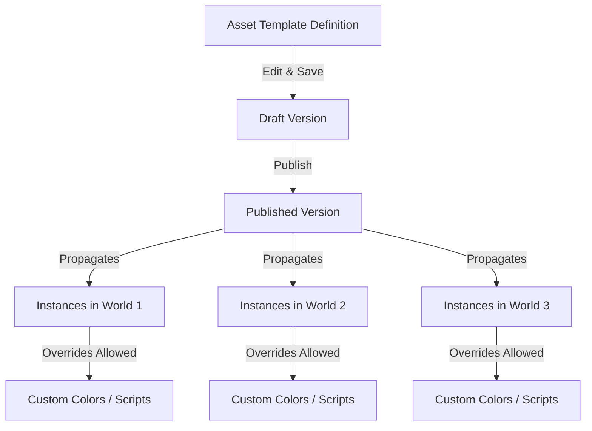

# Using Asset Templates in Horizon Worlds: Street Lights with Switches

Sahil (thesloppyguy)

September 4, 2025

---

## Introduction

This document will walk you through **using Asset Templates in Horizon Worlds**, focusing on a practical example: **creating reusable street lights that can be toggled with a switch**.

By the end, you’ll understand:

- How Asset Templates differ from Unity Prefabs.
- When and why to use templates.
- How to create, edit, and publish templates.
- How to attach and propagate script updates across worlds.

This example shows how templates save time and keep your worlds consistent—perfect for interactive objects like lights, doors, or NPCs.

### Prerequisites and Expectations

You should be familiar with:

- Horizon Worlds’ basic editor (adding objects, shapes, and scripts).
- How to work with File-Backed Scripts (FBS).
- General knowledge of prefabs in Unity (optional, but helpful for comparison).

---

## Topic One: What Makes Asset Templates Special?

Asset Templates are like **prefabs on steroids**:

- They bundle objects, scripts, and behaviors into one reusable asset.
- You can spawn as many copies as you want.
- When you update the template, changes propagate to every instance in every world.

### How They Differ from Unity Prefabs

| Feature            | Unity Prefabs                        | Horizon Asset Templates                  |
| ------------------ | ------------------------------------ | ---------------------------------------- |
| Scope              | Single project                       | All your worlds                          |
| Change Propagation | Updates instances in current project | Updates instances across all worlds      |
| Versioning         | No built-in version history          | Built-in version control and rollback    |
| Property Overrides | Limited per instance                 | Explicit overrides with push/revert flow |

### When to Use Templates

Use Asset Templates when:

- You want **reusable objects** across multiple worlds (streetlights, furniture, NPCs).
- You expect to **update objects later** and want changes to sync everywhere.
- You want **per-instance customization** (e.g., different light colors per streetlight).

⚡ **Street Light Example:**
Imagine a city scene with 100 street lights. If you later decide to make the lights brighter, you don’t want to update each one by hand. With templates, you just update once and publish.

---

## Topic Two: Walkthrough – Street Lights with Switches

Now let’s build an interactive street light using Asset Templates.

### Step 1 – Create the Base Asset

1. Add a **Cylinder** (pole) and a **Sphere** (lamp head).
2. Group them into an **Asset Template** (right-click → Create Asset → choose _Template_).
3. Rename it “Street Light”.

### Step 2 – Add a Switch

1. Create a small **Cube** to act as a wall switch.
2. Add it as a **child object** of the Street Light template.
3. Place the switch at an accessible height.

### Step 3 – Add the Script

Here’s a simple **File-Backed Script (FBS)** for toggling the light:

```lua
-- StreetLightToggle Script
-- Attach this to the switch object

lightOn = true

function onInteract(player)
    lightOn = not lightOn
    self.parent.sphere.light.enabled = lightOn
end
```

- The script toggles the lamp sphere’s light component on or off.
- It’s attached to the switch object but affects the parent (the Street Light).

### Step 4 – Publish the Template

1. Edit the template definition.
2. Attach the script to the switch.
3. Save → Publish.

✅ Now every instance of the Street Light has a working switch.



### Step 5 – Property Overrides

Want different colored lights?

1. Place several instances of your Street Light.
2. Override the **light color property** on each one.
3. Overrides stay even if you later update the script.

---

## References

- [Meta Horizon Worlds Documentation – Asset Templates](https://www.oculus.com/horizon-worlds/)
- [Unity Prefabs Overview](https://docs.unity3d.com/Manual/Prefabs.html)
- [Technical Writing Guide](https://medium.com/shecodeafrica/a-guide-to-technical-writing-7efcd0e70166)

---
